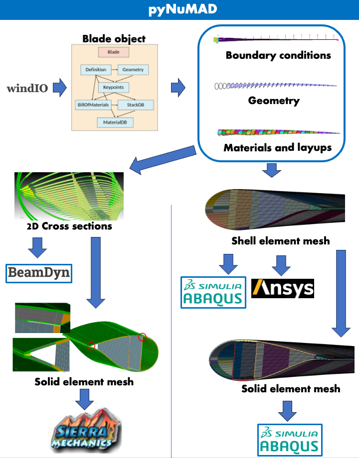

 # pyNuMAD
[pyNuMAD (Python Numerical Manufacturing And Design)](https://github.com/sandialabs/pyNuMAD) is an object-oriented, open-source software program written in Python which simplifies the process of creating a three-dimensional model of a wind turbine blade. The tool organizes all blade information including aerodynamic and material properties as well as material placement into an
intuitive API for use with other softwares. The purpose of pyNuMAD is to provide an intermediary between raw blade data in the form of yaml, excel, xml files and analytical platforms
(ANSYS, Cubit, openFAST, etc).

For any questions or support [create a new issue](https://github.com/sandialabs/pyNuMAD/issues/new) on GitHub.

## Documentation
Documentation for pynumad is accessible at https://sandialabs.github.io/pyNuMAD/.

## Examples

Step-by-step examples are located in the [examples](https://github.com/sandialabs/pyNuMAD/tree/main/examples) folder. Follow allong in the documentation.

## License

pyNuMAD is licensed under BSD 3-clause license. Please see the
[LICENSE](https://github.com/sandialabs/pyNuMAD/blob/main/LICENSE) included in
the source code repository for more details.

## Acknowledgements 

pyNuMAD is currently being developed with funding from Department of Energy's
(DOE) Energy Efficiency and Renewable Energy (EERE) Wind Energy Technology Office (WETO). 
